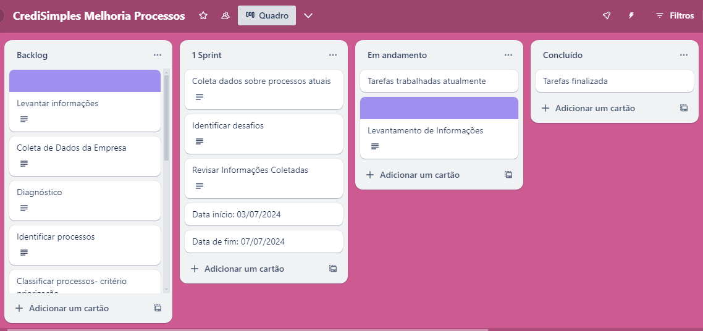

<h5>Trabalho Prático do Módulo 1<h5>

Bootcamp **“Análise de Processo de Negócio”**, realizado pela XP EDUCAÇÃO / IGTI - INSTITUTO DE GESTÃO DE TECNOLOGIA DA INFORMAÇÃO.

**Informações gerais:**

Disciplina: Análise de Processo de Negócios 

Módulo: I - Fundamentos de Processos de Negócios

Professor: Enivaldo Soares Bigão

**Objetivos:**

Exercitar os seguintes conceitos trabalhados no Módulo: 

1. O ciclo de vida da gestão por processos;
2. Gestão de processos de negócio; 
3. Tipos e visões de processos; 
4. Organização do gerenciamento de processos; 
5. Gerenciamento corporativo de processos; 
6. Análise de processos.

**Tarefas:**

Os alunos deverão desempenhar as seguintes atividades: 

1. Analisar o caso apresentado. 
2. Realizar um diagnóstico para o caso proposto: 

​		a. Identificando o tipo de processo proposto. 

​		b. Classificando quanto aos critérios de priorização.

​		c. Estabelecendo as diretrizes para a transformação do processo. 

​		d. Elaborando um diagrama de escopo para o processo proposto. 

3. Responder às questões apresentadas, levando em consideração o caso e o que foi estudado até o momento, selecionando a afirmativa mais adequada.

**O que realizamos:**

Dividimos esse projeto em algumas etapas:
1.Mapear e documentar os processos existentes na CrediSimples.

2.Diagnosticar ineficiências e gargalos nos processos identificados.

3.Propor e implementar melhorias para aumentar a eficiência operacional.

3.Apresentar um projeto de inovação com propostas de melhoria validadas.

**Metodologia utilizada:**

Neste projeto, aplicamos a **metodologia ágil Scrum** para gerenciar e executar as atividades planejadas. O Trello foi escolhido como ferramenta de gestão de projetos devido à sua capacidade de visualização e flexibilidade. Aproveitamos para estudar os **valores e princípios da Metodologia Ágil, os papéis e as cerimônias do SCRUM.**

O trabalho meu ajudou a compreender como entender os Processo de Negócios de uma empresa é uma etapa importante, pois não existe trabalho isolado. Ao pensar nas soluções tecnológicas devemos estar alinhados com as necessidades e objetivos da mesma. A partir de Processos bem mapeados e entendidos é possível identificar gargalos, propor melhorias na eficiência operacional e otimizar custos.

**Ferramentas:**
Miro app: https://miro.com/app/board/uXjVK20rRXg=/

Trello: https://trello.com/pt-BR

