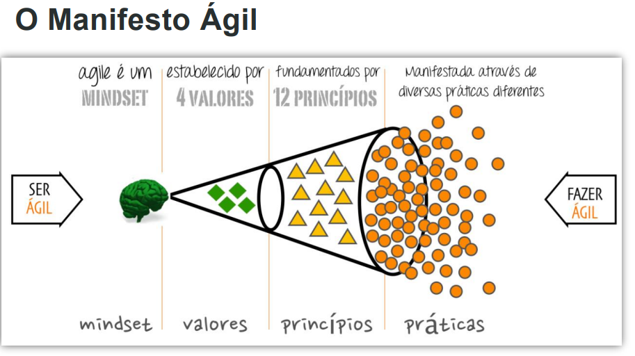

Repositório dos trabalhos práticos do curso Fundamento de Análise de Processo de Negócios.

< a href = "https://github.com/RegiMaria/XPEducacao_Bootcamp/tree/xpeducacao/Metodologia_Agil"> Repositório dos trabalhos do curso Metodologias Ágeis -  Fundamentos </a>

<a href = "APN/TPM1"> AnáliseProcessoNegocio </a>

